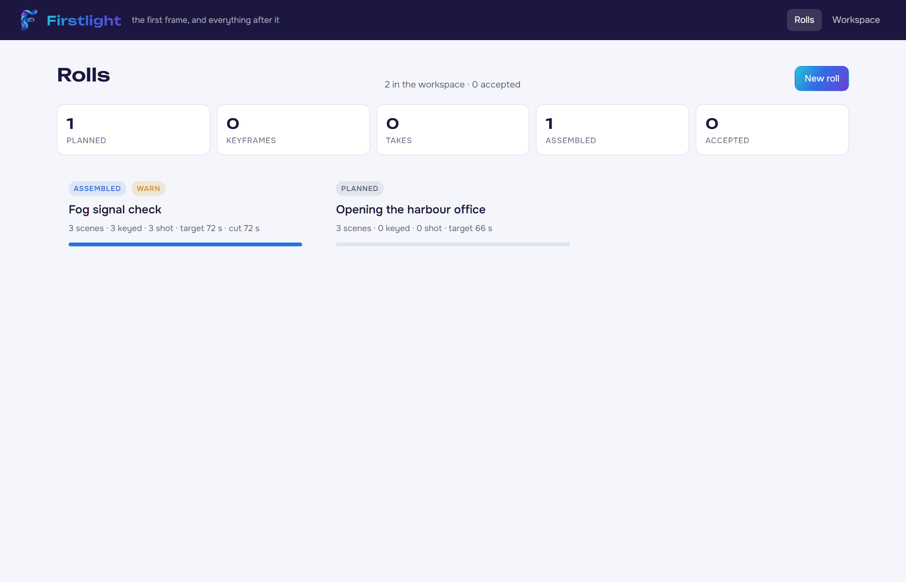
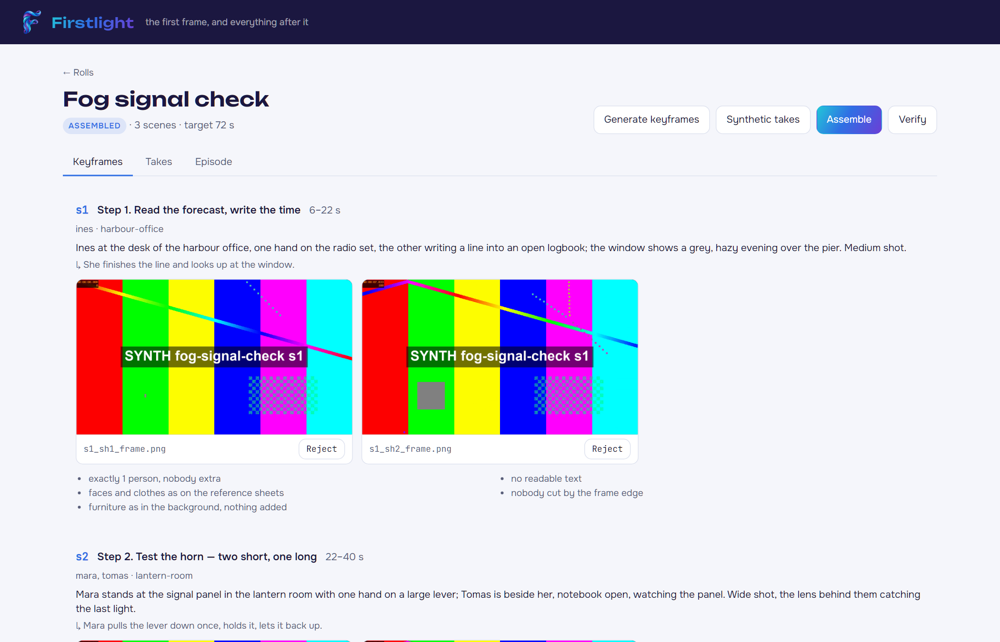
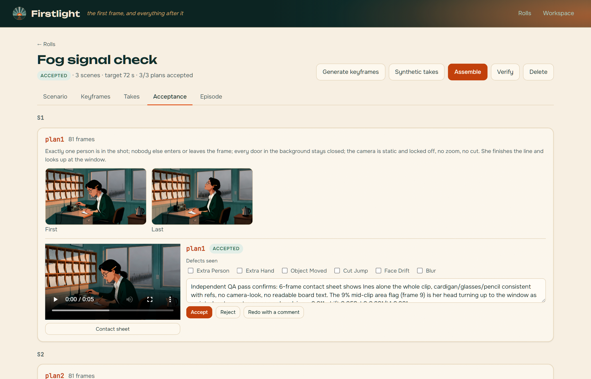
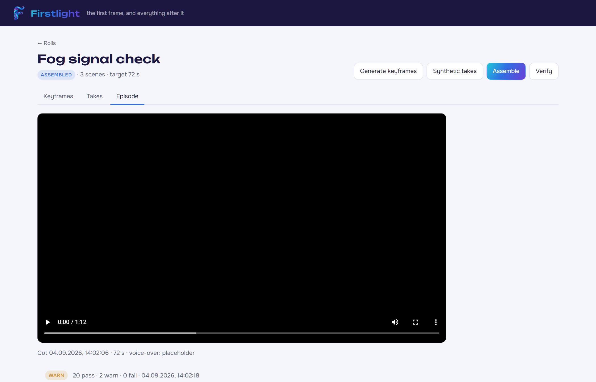
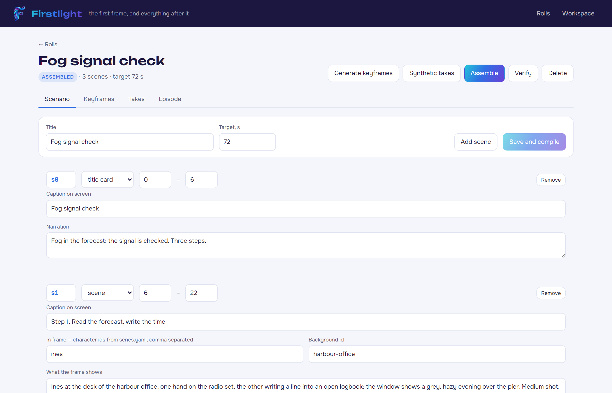
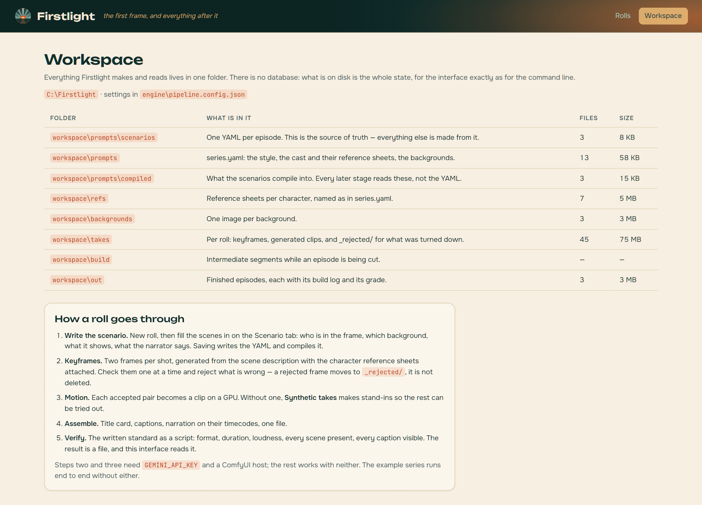
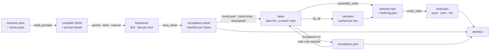
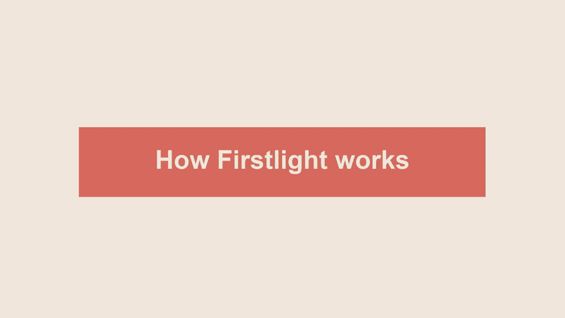

<p align="center">
  
</p>

<p align="center"><b>The first frame, and everything after it.</b><br/>
A pipeline that turns a written scenario into a finished training film — keyframes, motion, narration, captions, cut and acceptance — with no editing by hand.</p>

<p align="center">
  
</p>

<p align="center">
  
  
  
  
  
  <a href="https://kleerohere.github.io/Firstlight/"></a>
</p>

> **Where the name comes from.** *First light* is the moment a new telescope produces its first image — the instrument works. It is also dawn, which makes it family to [Aurora](https://github.com/KleeroHere/Aurora), the offline knowledge base these films are made for. And it is, literally, the *first frame*: the whole engine is built on first-frame-to-last-frame video generation. Aurora is what people see. Firstlight is how the films inside it get made.

## What it does

You write an episode as a scenario: scenes with a caption, who is in the frame, which background, what the frame shows, how it moves, and what the narrator says. Firstlight does the rest:

1. **Compiles** the scenario into frame prompts, with the series style and each character's reference sheets attached — the same sheets every time, so a face stays the same face across forty frames.
2. **Generates keyframes** — the first and last frame of every shot — and lays them out on an acceptance sheet with a checklist per frame.
3. **Generates motion** between those two frames on a rented GPU (Wan 2.2 first-last-frame in ComfyUI), in batches, overnight, with a queue that knows what is already done.
4. **Cuts the episode**: title card, captions over every scene, dividers, a closing memo card, narration synthesised per line and placed on its timecode, loudness normalised to broadcast level, encoded for the target player.
5. **Grades it** against a written standard — container, codec, resolution, duration against target, loudness, every scene present, every caption actually visible in the frame — and writes the report as a file the interface reads.

There is no timeline and no editor. The scenario is the edit.

| Every roll and how far it has got | One roll: keyframes with their checklist |
| --- | --- |
|  |  |
| **Plan-level acceptance** | **The episode, and its report** |
|  |  |
| **The scenario, edited in place** | **What is in the workspace** |
|  |  |

*Real screens against the example series, not mockups. The interface follows
your OS light/dark setting; it is drawn in the same palette as the films —
see [docs/BRAND.md](docs/BRAND.md).*

## Why it is built this way

Three facts about the production shaped everything else:

- **Consistency is the whole problem.** An illustrated series with a fixed cast lives or dies on whether the keeper looks like the keeper in every frame. So every frame prompt carries the same reference sheets, the same "passport" line for each character, and the same consistency clause verbatim; a scene names only the people who are in it; and the second keyframe of a shot is generated *from* the first, not from the description again.
- **Generation is expensive, judgement is cheap.** A keyframe is a few cents and a minute; a wrong keyframe animated into a clip is a dollar and ten minutes. So keyframes are checked by eye one at a time *before* anything moves, the pipeline never regenerates what already exists unless told to, and every stage writes a state file so a night run can pick up where it left off.
- **Nobody edits video at 2 a.m.** Everything after the takes exist is deterministic: captions are drawn from the scenario, narration is placed by timecode, the cut is a concat without re-encoding, and acceptance is a script. The morning report says which episodes are done and which frames need a human.

## The pipeline



Keyframes and motion each have three interchangeable backends — see
**[Backends](#backends)** below and [docs/ARCHITECTURE.md](docs/ARCHITECTURE.md)
for the full diagram and trade-off table.

### Stages and their scripts

| Stage | Script | What it does |
| --- | --- | --- |
| Compile | `build_prompts.py` | YAML scenarios → prompt sheets (`sheets/*.md`) and compiled JSON, one per roll. Validates cast against the series, warns about a line that will not fit its scene. |
| Plan | `make_plans.py`, `preflight_plans.py`, `check_plan_counts.py`, `check_scene_cast.py` | Shot plans per scene; checks that every scene has the right number of shots and that nobody appears who is not in the cast. |
| Keyframes | `gemini_shots.mjs`, `gemini_frames.mjs`, `flf_keys.mjs`, `klein_keys.py`, `ingest_manual_shots.mjs` | First and last frame per shot. Three backends — Gemini image-edit (paid), a local Flux.2 Klein 9B via ComfyUI (free), or a human-drawn frame intake. `--only s2,s3` regenerates by name; nothing else is touched. |
| Review | `keys_sheet.mjs`, `flf_verify.mjs`, `keys_delta.py`, `align_keys.py` | The acceptance sheet; a measure of how much a shot's two keys differ (a frozen shot is caught here, before it is animated). |
| Motion | `flf_batch.mjs`, `wavespeed_batch.mjs`, `comfy_batch.mjs`, `comfy_frames.mjs`, `flf_night.mjs`, `flf_trim.mjs`, `krupno.mjs` | Batches keyframe pairs through a Wan 2.2 FLF2V ComfyUI workflow — on a rented pod, or locally with `--gguf` — or through the WaveSpeed API (Kling / Seedance / Wan) with `wavespeed_batch.mjs`. Both read `workspace/<id>/acceptance.json` first: an accepted plan is left alone, a rejected or redo one is reshot without `--redo`. `pod_exec.mjs` runs commands on the pod when SSH is not available. |
| Intake | `sort_downloads.mjs`, `collect_shots.mjs`, `ingest_manual_shots.mjs`, `shot_kits.mjs` | Files a folder of downloads into the right scenes; assembles the kit of references a human needs to redo a shot by hand. |
| Narration | `tts_all.mjs`, `verify_vo_fit.mjs`, `retime_scenes.mjs` | One ElevenLabs call per line, cached — a re-cut costs nothing; checks every line fits its scene at the narrator's reading speed. |
| Cut | `assemble_video.mjs`, `assemble_from_plans.mjs`, `replace_plates.mjs`, `make_synthetic_takes.mjs` | Renders the graphic cards, overlays captions, places narration, normalises loudness, encodes H.264 High 4.1 with faststart. `assemble_from_plans.mjs` is the alternate cut — a scene built from its own plan-list clips, close-ups inserted from that same scene only. `make_synthetic_takes` fakes the takes so the cut can be tested without a GPU. |
| Grade | `verify_video.mjs`, `verify_clips.mjs` | The written standard as a script; the result printed for a person and written as JSON for the interface. |
| Night | `run_night.mjs`, `night_batch.mjs`, `spend.mjs` | One process for the night: shoot what has keys, cut what has takes, grade what has a cut, write the morning summary. Money spent is tracked per stage. |

`engine/lib.mjs` holds the handful of things every script shares: config, paths, `ffprobe`, running a command. `engine/paths.py` is the same for the Python side. Everything reads `engine/pipeline.config.json`.

## Backends

Two stages — keyframes and motion — have more than one implementation, switched
in one place, `pipeline.config.json` → `backends`:

```jsonc
"backends": {
  "keys":   { "default": "gemini",    "options": { "gemini": "…", "klein": "…", "manual": "…" } },
  "motion": { "default": "comfy-pod", "options": { "comfy-pod": "…", "comfy-local": "…", "wavespeed": "…" } }
}
```

| Stage | Backend | Cost | Notes |
| --- | --- | --- | --- |
| Keys | `gemini` (default) | ≈$0.067 / key (1K) | `gemini_shots.mjs` / `flf_keys.mjs`. Image-edit API, up to 5 reference sheets held at once — best identity lock. |
| Keys | `klein` | free (local GPU) | `klein_keys.py`. Flux.2 Klein 9B distilled on ComfyUI, ≈16 s/key at 1280×720 on an RTX 4080 — weaker multi-reference consistency, no image-edit. |
| Keys | `manual` | free (human time) | `ingest_manual_shots.mjs`. A person generates in the same web UI Gemini uses; the script only intakes, resizes, and rebuilds the acceptance sheet. |
| Motion | `comfy-pod` (default) | RunPod, ≈$0.5–0.7/h | `flf_batch.mjs --host <pod>`. Wan 2.2 14B FLF2V, lightx2v 4-step + NAG by default. |
| Motion | `comfy-local` | free (owned GPU) | Same script, `--gguf --quant Q5_K_M` for 16 GB VRAM, or `--full --steps 20 --cfg 3.5 --shift 8` for a full non-distilled pass. |
| Motion | `wavespeed` | per clip, see **Cost & time** | `wavespeed_batch.mjs --model <name>`. Kling, Seedance or Wan through one cloud API — no GPU to manage, billed per clip. |

Full trade-off table (speed, where the negative prompt stops working at
cfg = 1, and why) is in [docs/ARCHITECTURE.md](docs/ARCHITECTURE.md).

## Acceptance

Below the scene-level checklist is a second, finer-grained acceptance screen,
one level down: **plan**, not scene. A plan is one shot in the plan-list
(`engine/make_plans.py`) — its first and last keyframe, and every clip shot
for it, including seed variants (`plan3.mp4`, `plan3_s12.mp4`, …). For each
clip the screen renders a **contact sheet** on demand (`engine/contact_sheet.mjs`,
six frames tiled by ffmpeg, cached beside the clip), and shows a defect
checklist — extra person, extra hand, object moved, cut jump, face drift,
blur — a comment field, and **Accept / Reject / Redo with a comment**.

The decision is written to `workspace/<roll>/acceptance.json`, keyed by the
clip it judges. `flf_batch.mjs` and `wavespeed_batch.mjs` both read this file
before shooting a plan: `accepted` is left alone (even a missing clip file
needs `--redo` to reshoot it on purpose), `rejected` and `redo` are reshot on
the very next run, no flag needed. The engine only ever reads this file —
every write comes from the interface, the same one-way relationship
`_rejected/` already has with keyframes. The rolls list and the roll header
show how many plans are accepted, in the reshoot queue, awaiting a first
review, or not shot yet — plus total spend, broken down by backend.

## Working with Claude (and with agents in general)

Two steps in this pipeline are judgement rather than arithmetic — deciding
whether a shot is good enough to keep, and deciding whether a scene has been
broken into the right shots. Both are a command:

```bash
node engine/claude_agent.mjs frames     --roll <roll>   # judge the start frames
node engine/claude_agent.mjs qa         --roll <roll>   # judge the clips
node engine/claude_agent.mjs storyboard --roll <roll>   # review the shot breakdown
```

Each runs one of two ways and picks automatically.

**With `ANTHROPIC_API_KEY`** (and `npm install` in `engine/` for the official
SDK) it calls Claude with `docs/QA-CHECKLIST.md` and the twelve-frame contact
sheets as images, asks for one verdict per plan through a strict tool schema,
and writes the result into `workspace/<roll>/acceptance.json`. The model is
`$ANTHROPIC_MODEL`, default `claude-sonnet-5`.

**Without a key**, or with `--packet`, it writes an **agent packet** to
`workspace/<roll>/_review/<mode>/`: the contact sheets, the metrics, the motion
lines, the checklist verbatim, and a verdict template. Hand that folder to any
agent session — Claude Code, another model, or a person — and put the answer
back with `--apply <verdict.json>`. The packet is not a downgrade: it is how a
human reviewer and a model reviewer are given exactly the same evidence, which
is the only way their verdicts can be compared, and it is what makes the
pipeline usable from a session that has no API key of its own.

Frame verdicts land under `frames` in `acceptance.json`, clip verdicts under
`plans`, because the shooters read `plans` to decide what still needs shooting.

**What an agent needs to know is in the repository, not in a prompt you type:**

| File | What it holds |
|---|---|
| [`CLAUDE.md`](CLAUDE.md) | The production command sequence, the hard rules, where the state lives. Read first by any agent working here. |
| [`docs/PRODUCTION-RULES.md`](docs/PRODUCTION-RULES.md) | The shooting rules and the defect each one prevents. |
| [`docs/QA-CHECKLIST.md`](docs/QA-CHECKLIST.md) | The acceptance procedure, the defect vocabulary, the thresholds. |
| `engine/pipeline.config.json` → `production`, `qa` | The same rules as data. `engine/guard.mjs` and `engine/guard.py` read them, so the Node and Python halves of the engine cannot drift apart — and changing a rule means changing this file, not remembering a better prompt. |
| [`.env.example`](.env.example) | Every environment variable the pipeline can use and which script reads it. |

The guard is enforced, not advisory: `wavespeed_batch.mjs` and `flf_batch.mjs`
both run every motion line through it before spending anything, and a line
missing the head-count clause — or carrying a phrase known to produce a defect
— stops the run.

## Cost & time

Honest numbers, not a promise — they move with prices and hardware. The episode
line is measured, not modelled: it is what the two Showcase episodes actually
cost, counting the fourteen frames and clips that acceptance rejected and sent
back. The ledger every paid script writes to is `reports/wavespeed-spend.json`.

| Item | Cost / time |
| --- | --- |
| Seedream 4 start frame or end key (`wavespeed_stills.mjs`) | $0.027 |
| Gemini key (1K, image-edit) | ≈$0.067 |
| Kling 2.6 Std, 5 s clip — image-to-video only, **no end frame** (`--model kling26-std`) | $0.21 |
| Kling 2.6 Pro, 5 s clip — takes an end frame (`--model kling26-pro`) | $0.35 |
| Kling Pro (2.5 Turbo), 5 s clip (`--model kling-pro`) | $0.35 |
| **One 80 s episode, four scenes, twelve clips, reshoots included** | **≈$4.50** |
| RunPod GPU rent | ≈$0.5–0.7 / h |
| Wan 2.2 14B FLF2V, 720p, 81 frames, lightx2v 4-step — RTX 4080 16 GB | ≈12 min |
| Same, full pass (`--full`, 20 steps, no distillation) — RTX 4080 16 GB | ≈55 min |
| Flux.2 Klein key, 1280×720 — RTX 4080 16 GB | ≈16 s |

## The interface

The engine ran from the command line for a month. What it needed was not a dashboard but a better version of the one thing that was already there: the acceptance sheet — a static HTML page the keyframe stage wrote beside the frames, with a checklist per frame, opened in a browser and acted on in a file manager.

The interface is that page made live. It reads the same folders the scripts read, shows every roll and how far it has got, every scene with its keyframes and the checklist, the takes, the cut episode and its grade — and it runs the scripts. Rejecting a frame moves it to `_rejected/`, which is where the engine already kept them. There is no database: close the server and nothing is lost, because the workspace was the state all along.

It also writes, in one place. **New roll** creates a scenario — a title card, one scene, a closing card — and the **Scenario** tab edits it: the caption, who is in the frame, the background, what the frame shows, the one movement, the narration. Saving writes the YAML and compiles it in the same press, because an edit that was saved but not compiled would show in the interface and nowhere else. The file stays hand-editable and keeps its shape — prose as block text, timings on one line, keys in order — so it can be edited in a text editor between two visits and the interface picks it up.

Deleting a roll removes its scenario and the compiled copy, never the frames and takes. Those are hours of generation; a scenario can be written again in ten minutes.

```
ui/server/server.mjs   lists rolls, serves frames and clips, runs scripts as jobs (SSE log)
ui/src/                React, two screens and a drawer; Aurora's tokens with Firstlight's palette
```

## Download / Run

Three ways to see it, in order of how much you want to install:

- **[Live demo](https://kleerohere.github.io/Firstlight/)** — the Harbour Light
  example, static, read-only, no server behind it: every roll, its keyframes
  and takes, the plan-level acceptance screen, spend by backend. It is the
  same interface reading a JSON snapshot instead of the workspace — see
  [ui/scripts/build-demo-data.mjs](ui/scripts/build-demo-data.mjs) and
  `DEMO` in [ui/src/api.ts](ui/src/api.ts). Anything that writes (new roll,
  accept/reject, running a script) says so and does nothing; append `?demo=1`
  to any normal build of the interface to preview the same mode locally.
- **`Firstlight.exe`** (Windows, portable, no Node install required to run
  it) — the interface and its server as one file, `engine/` and the example
  `workspace/` beside it. Not published as a download in this repository (it
  bundles a full copy of the Node runtime, ~90 MB, and this project has no
  release process yet) — build it yourself:

  ```bash
  build\build-exe.cmd            # or: node build/build-exe.mjs
  ```

  This installs `ui/`'s dependencies if needed, builds the interface, then
  uses Node's own [single-executable-application](https://nodejs.org/api/single-executable-applications.html)
  support to bundle `ui/server/server.mjs` (esbuild to CommonJS, since that is
  what an SEA entry point has to be) into a copy of the Node binary
  (`postject`), with the app icon set on it first — `rcedit`, and
  strictly *before* postject touches the binary: handing postject's output to
  rcedit afterward hangs it indefinitely (confirmed by timing both orders;
  rcedit is fine with the plain copy either way, under a second). `build/firstlight.ico`
  is `docs/brand/firstlight.png` rendered at six sizes (`build/make-icon.py`);
  the same file is `ui/public/favicon.ico`. The mark itself is generated rather
  than drawn — see [docs/BRAND.md](docs/BRAND.md) for how, and for the palette.
  The result, `build/dist/Firstlight/Firstlight.exe`, opens a
  browser at <http://localhost:7331> by itself — there is no terminal to read
  a URL from — and reads `engine/` and `workspace/` next to itself, or from
  `--workspace <path>`. `engine/`'s own scripts (keyframes, motion, narration)
  still need a system Node and Python on PATH when the interface starts one as
  a job; only the server and the interface run from the .exe alone.
- **From source** — see **Quick start** below.

## Showcase

Two Harbour Light episodes, produced end to end by the pipeline described below
— nothing hand-assembled around it — plus a narrated walkthrough that the same
assembler cut. Every start frame and every clip went through an acceptance gate:
**24 frames judged, 6 rejected and reshot; 24 clips judged, 8 rejected and
reshot.** Every reject named a cause to change, and every fix went into the
scenario or `engine/pipeline.config.json` rather than into a one-off command.
Total model spend for both episodes, reshoots included: **$9.90**.

Click a poster to watch it in the live demo; the full-quality files are attached
to the [latest release](https://github.com/KleeroHere/Firstlight/releases/latest).

| [](https://kleerohere.github.io/Firstlight/demo/files/out/Fog%20signal%20check.mp4) | [](https://kleerohere.github.io/Firstlight/demo/files/out/Handover%20at%20the%20pier.mp4) |
| --- | --- |
| **Fog signal check** · 80 s · four scenes, twelve clips. A lighthouse crew checks a fog signal: forecast, horn, log, confirmation. Grades **22 pass / 0 warn / 0 fail**. | **Handover at the pier** · 80 s · four scenes, twelve clips. A shift changes hands: keys, a tag on a board, the last line cast off, a lantern raised once. Grades **22 pass / 0 warn / 0 fail**. |

Every scene is cut **wide → medium → close → back to the wide**, from three
five-second clips shot for that scene. No scene holds a frame, stretches a clip
or slows one down: the build log records `still: false` for all eight, and the
assembler trims 0.2 s per scene rather than filling 10.

[](https://github.com/KleeroHere/Firstlight/releases/latest/download/How-Firstlight-works.mp4)

**How Firstlight works** · 2:41 · narrated walkthrough: six steps, one command
each; the scenario is the edit; start frames and their acceptance; motion
backends (cloud GPU, local, API); QA agents and metrics — reject, redo, accept;
cut, narration, verify; what it cost. The picture above is a silent preview —
**[watch the full film with narration](https://github.com/KleeroHere/Firstlight/releases/latest/download/How-Firstlight-works.mp4)**
(release asset, 1080p) or open it from the [live demo](https://kleerohere.github.io/Firstlight/).
Source, narration script and the cut list are in [`docs/demo/`](docs/demo/).

What was accepted and on what evidence — contact sheets, metrics and the two
blemishes that were kept rather than hidden — is in
[`docs/DEMO-REVIEW.md`](docs/DEMO-REVIEW.md); how it was produced, command by
command, is in [`docs/DEMO-LOG.md`](docs/DEMO-LOG.md).

Open the [live demo](https://kleerohere.github.io/Firstlight/) to browse both
rolls: scenarios, start frames, plan lists, contact sheets and every acceptance
decision as the interface shows them. (The demo's media is transcoded to 720p so
the page stays under 30 MB; the release assets are the 1080p originals.)

## Quick start — the example series

The repository ships a small fictional series so the whole loop can be run without a GPU, an API key, or a production behind it: *Harbour Light*, a lighthouse and the three people who run it. `workspace/prompts/series.yaml` defines the world; `workspace/prompts/scenarios/fog-signal-check.yaml` is one 80-second episode.

```bash
pip install pyyaml               # ffmpeg and ffprobe on PATH, Node 22
python engine/build_prompts.py   # scenario → compiled JSON + prompt sheet
node engine/make_synthetic_takes.mjs --id fog-signal-check
node engine/assemble_video.mjs --id fog-signal-check --placeholder-vo
node engine/verify_video.mjs "workspace/out/Fog signal check.mp4"
```

That produces a real 1080p30 episode — title card, four captioned scenes, a memo card, placeholder narration, normalised audio — and grades it: on the example it comes out 20 pass, 2 warn, 0 fail — both warnings about the placeholder narration (it is silent, so the audio track compresses below the nominal bitrate). With a real voice they go away.

### The interface

On Windows, double-click **`start.cmd`** in the repository root. It installs
what is missing, builds the interface if the sources are newer than the build,
serves both the interface and the API on one port and opens the browser at
<http://localhost:7331>. Closing the window stops it.

The same thing by hand, on any platform:

```bash
cd ui && npm install && npm run build
cd .. && node ui/server/server.mjs --serve dist   # http://localhost:7331
```

While working on the interface itself, run the two halves separately so Vite
can hot-reload:

```bash
node ui/server/server.mjs   # API and files on :7331
cd ui && npm run dev        # interface on :1421, proxying /api to the server
```

### Making it real

Three things turn the example into a production, all of them configuration:

- **Keyframes** — `GEMINI_API_KEY` in the environment, reference sheets in `workspace/refs/<character>/` named as in `series.yaml`. No key, or no budget left in `reports/gemini-spend.json`? `klein_keys.py` runs the same job on a local ComfyUI, free.
- **Motion** — a ComfyUI host with the Wan 2.2 first-last-frame workflow (`engine/wan22_i2v_nag.api.json` is the one used in production): `--host https://<pod>-8188.proxy.runpod.net`, `POD_ID` for `pod_exec`. No pod? The same `flf_batch.mjs --gguf` runs locally on 16 GB VRAM, or `wavespeed_batch.mjs` shoots through a billed cloud API with no GPU at all.
- **Narration** — `ELEVENLABS_API_KEY`, and one `voiceId` in `pipeline.config.json`, pinned for the life of the series.

See **[Backends](#backends)** for the full picture and `pipeline.config.json` → `backends` for the switch itself.

## Honest notes

- This engine was built for one production — thirty-odd episodes for a staff handbook — and generalised afterwards. The shape is general; some defaults (durations, caption length, the 1920×1080/30 target) are that production's standard.
- The engine's inline comments are in Russian, the language it was built in. The README, the configuration, the interface and the example are in English. The comments are worth reading even so: most of them record why a decision was made, usually after something went wrong at night.
- The example series is fictional. No real organisation, person or film appears in this repository.

## License

MIT — see [LICENSE](LICENSE).
