# Architecture

Firstlight is one pipeline with three backends plugged into two of its
stages — keyframes and motion — behind a single switch in
[`engine/pipeline.config.json`](../engine/pipeline.config.json) (`backends`).
Everything else (compile, review, narration, cut, grade) has exactly one
implementation; it is the generation stages that need a choice, because
generation is where price, speed and quality trade against each other, and
the right trade-off is different for a first pass than for a final one.

## The pipeline, with every backend

```mermaid
flowchart LR
    S["scenario.yaml<br/>+ series.yaml"] -->|build_prompts| C["compiled JSON<br/>+ prompt sheets"]
    C --> MK["make_plans<br/>plan-list"]

    subgraph KEYS["keyframes — backends.keys"]
        direction TB
        K1["gemini_shots / flf_keys<br/>Gemini image API"]
        K2["klein_keys.py<br/>local ComfyUI, Flux.2 Klein 9B"]
        K3["ingest_manual_shots<br/>drawn by hand, web UI"]
    end
    MK --> KEYS
    KEYS --> KSHEET["keys_sheet<br/>acceptance sheet"]

    subgraph MOTION["motion — backends.motion"]
        direction TB
        M1["flf_batch.mjs --host pod<br/>ComfyUI on RunPod"]
        M2["flf_batch.mjs --gguf<br/>ComfyUI, local GPU"]
        M3["wavespeed_batch.mjs<br/>WaveSpeed API (Kling / Seedance / Wan)"]
    end
    KSHEET --> MOTION
    MOTION --> T["takes<br/>plan&lt;N&gt;_s&lt;seed&gt;.mp4"]

    T --> ACC["acceptance.json<br/>UI decisions"]
    ACC -->|redo only rejected| MOTION

    T -->|tts_all| V["narration<br/>cached per line"]
    T -->|assemble_video /<br/>assemble_from_plans| E["episode.mp4<br/>+ build-log.json"]
    V --> E
    E -->|verify_video| R["verify.json"]
    R --> UI["interface"]
    ACC --> UI
```



## Why two stages, three backends each

**Keyframes (`backends.keys`)**

| Backend | Script | Cost | Speed | Consistency | Notes |
| --- | --- | --- | --- | --- | --- |
| `gemini` | `gemini_shots.mjs`, `flf_keys.mjs` | ~$0.067 / key (1K, image-edit) | ~15–30 s | Best: up to 5 reference sheets held at once, image-edit keeps the room and clothes | Paid API, needs `GEMINI_API_KEY`; the default, and the one the acceptance checklist assumes |
| `klein` | `klein_keys.py` | Free (local compute) | ~16 s / key at 1280×720, RTX 4080 | Weaker: distilled 9B model, effectively 2–3 references via `ReferenceLatent`, no image-edit — regenerates the frame rather than editing it | Needs a local ComfyUI with Flux.2 Klein 9B (fp8) + Qwen3-8B text encoder installed |
| `manual` | `ingest_manual_shots.mjs` | Free (human time) | Minutes per frame | Best when it works: a person is generating in the same web UI Gemini uses, with full judgement | Used when API quota runs out or a frame needs more correction than a prompt can express; the script only intakes, resizes and re-runs the acceptance sheet |

**Motion (`backends.motion`)**

| Backend | Script | Cost | Speed (RTX 4080, per clip) | Quality | Where the negative prompt stops working |
| --- | --- | --- | --- | --- | --- |
| `comfy-pod` | `flf_batch.mjs --host <runpod>` | RunPod GPU rent, ≈$0.5–0.7/h | Wan 2.2 14B, lightx2v 4-step, 720p, 81 frames ≈ 12 min | Good; AniSora + NAG hold the negative prompt at cfg=1 | Only if the pod's ComfyUI is missing the NAGuidance custom node — the script probes for it and disables NAG with a warning rather than shooting a batch blind |
| `comfy-local` | `flf_batch.mjs --gguf --quant Q5_K_M` | Free (owned GPU) | Same graph, GGUF-quantized for 16 GB VRAM; `--full --steps 20 --cfg 3.5 --shift 8` for a full (non-distilled) pass ≈ 55 min | `--full` is the highest quality this pipeline produces: real cfg, real negative sampling, no lightx2v/NAG involved at all | None in `--full` mode — negative conditioning participates normally above cfg 1. In the default 4-step lightx2v mode, same limit as `comfy-pod` |
| `wavespeed` | `wavespeed_batch.mjs --model <name>` | Per clip, see README § Cost & time (Kling 2.6 Std ≈ $0.21/5s, Seedance Lite ≈ $0.16/5s) | Seconds of local work (upload + poll); generation happens on WaveSpeed's infrastructure | Model-dependent; Kling models accept a `negative_prompt` field directly, Seedance/Wan take `camera_fixed` instead | Whatever the hosted model's own negative-prompt support is — this backend has no NAG or cfg control, it passes through what the API accepts |

The two motion backends that use ComfyUI (`comfy-pod`, `comfy-local`) are
*the same script* against *the same graph* — the only difference is `--host`
and, optionally, the local-hardware flags. That is deliberate: a roll shot
on the pod and reshot locally never drifts in how the graph is built, only
in how fast and how expensive it is.

## The adapter, concretely

`pipeline.config.json` → `backends.keys.default` / `backends.motion.default`
name the current choice; `backends.*.options` is documentation the UI and
this file both read from, so the trade-off table above and the pipeline
diagram never fall out of sync with what the config actually says. Switching
a roll to another backend is a different command, never a code change:

```bash
# keyframes: gemini is the default; klein is the free/local alternative
python engine/klein_keys.py --ref workspace/takes/<id>/<scene>_sh1_frame.png \
  --prompt "..." --out workspace/takes/<id>/keys/plan3_key.png

# motion: same graph, three hosts
node engine/flf_batch.mjs --id <id> --host https://<pod>-8188.proxy.runpod.net
node engine/flf_batch.mjs --id <id> --gguf --quant Q5_K_M
node engine/wavespeed_batch.mjs --id <id> --model kling26-std
```

## Acceptance

The acceptance screen (see README § Acceptance) is the one place a human
decision re-enters the pipeline as data rather than as a file moved by hand.
Decisions are written to `workspace/<roll>/acceptance.json`, keyed by the
clip they judge (`plan3`, or `plan3_s12` for a seed variant made with
`--suffix _s12` / `--seed 12`):

```json
{
  "plans": {
    "plan3": { "decision": "accepted", "at": "2026-09-05T21:14:00Z" },
    "plan4": { "decision": "rejected", "defects": ["extra-hand"], "comment": "hand floats off the desk edge", "at": "2026-09-05T21:16:00Z" },
    "plan4_s12": { "decision": "redo", "comment": "try a later seed" }
  }
}
```

`flf_batch.mjs` and `wavespeed_batch.mjs` both read this file before shooting
a plan: `accepted` is left alone even with a stale or missing clip file
(re-shooting it needs `--redo` explicitly), while `rejected` and `redo` are
re-shot on the next run with no flag needed. The engine only ever reads this
file — every write comes from the UI, exactly the same one-way relationship
`_rejected/` already has with keyframes.

## What stays single-implementation

Compiling (`build_prompts.py`), review (`keys_sheet.mjs`, `flf_verify.mjs`),
narration (`tts_all.mjs`, one ElevenLabs voice pinned per series) and
grading (`verify_video.mjs`) do not need a backend switch: there is one
correct way to turn a scenario into prompts, one way to measure whether two
keyframes moved, one voice per series by design, and one written standard a
finished episode either meets or does not. The adapter pattern exists
specifically where "how" has more than one right answer depending on budget
and deadline — that is keyframes and motion, and nowhere else in the
pipeline.
