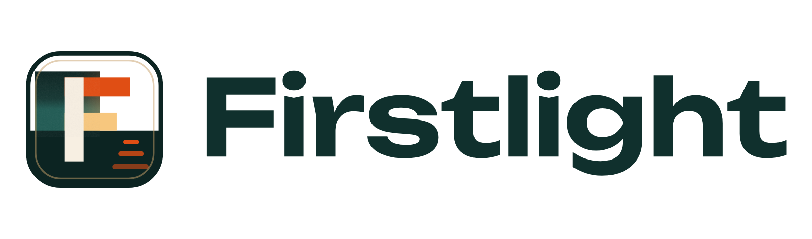
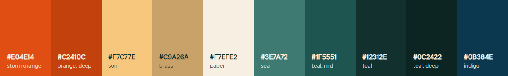
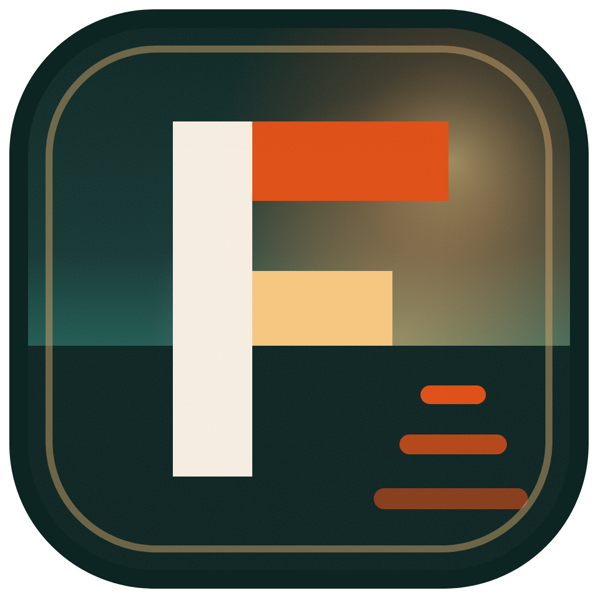

<p align="center">
  
</p>

# Brand

Firstlight looks like the films it makes. *Harbour Light* — the example series
in `workspace/` — is drawn as flat gouache travel-poster illustration: deep
teal and indigo, brass fittings, an apricot sunrise, cream paper, soft grain,
a thin dark contour. The interface, the logo and the episode cards all use
that one palette, so an episode playing inside the app never looks like it was
made somewhere else.

Every colour below was sampled off those illustrations
(`workspace/backgrounds/*.png`, `workspace/refs/*/base.png`) rather than
picked in a colour wheel.

---

## Palette

### The hot colour

One character in *Harbour Light* wears an orange storm jacket. It is the only
saturated warm colour in the whole world, which makes it the right thing to
spend on the parts of the interface you can act on — and nothing else.

| Token | Hex | Where it came from | Used for |
| --- | --- | --- | --- |
| `--fl-orange` | `#E04E14` | the storm jacket, lit | the logo, graphics, progress, large type |
| `--fl-orange-deep` | `#C2410C` | the same jacket in shade | links, and the fill of the primary button — the brightest orange that still carries cream text at AA |
| `--fl-orange-darker` | `#A83809` | — | the pressed / hover state of that button |
| `--fl-orange-bright` | `#F2703A` | — | graphics in the dark lightness |
| `--fl-orange-light` | `#F57F43` | — | links and the primary button in the dark lightness |

### Warm secondaries

| Token | Hex | Where it came from | Used for |
| --- | --- | --- | --- |
| `--fl-brass` | `#C9A26A` | the lantern-room fittings | hairlines, the tagline, keyframe progress |
| `--fl-brass-deep` | `#8A6A3C` | brass in shade | card rules on paper |
| `--fl-sun` | `#F7C77E` | the sun disc at the horizon | the lit nav item, the core of the mark |
| `--fl-apricot` | `#F4CFB0` | the sunrise band | washes |

### Cold ground

| Token | Hex | Where it came from | Used for |
| --- | --- | --- | --- |
| `--fl-teal-deep` | `#0C2422` | the lantern-room ceiling | the header; the page in the dark lightness |
| `--fl-teal` | `#12312E` | the same, one step up | cards in the dark lightness |
| `--fl-teal-raised` | `#173A36` | — | raised cards in the dark lightness |
| `--fl-teal-mid` | `#1F5551` | the harbour-office wall | the sea in illustrations |
| `--fl-sea` | `#3E7A72` | the water at dawn | mid-tones |
| `--fl-sea-pale` | `#A9C4BB` | the far shore | secondary text on teal |
| `--fl-indigo` | `#0B384E` | a knitted sweater, deep water | ink accents |

### Paper and ink

| Token | Hex | Used for |
| --- | --- | --- |
| `--fl-paper` | `#F7EFE2` | the page |
| `--fl-paper-raised` | `#FDF8EE` | cards |
| `--fl-paper-edge` | `#E3D3B8` | borders |
| `--fl-cream` | `#F2E7D6` | text on teal |
| `--fl-ink` | `#10302D` | body text — a deep teal-black, never pure black |
| `--fl-ink-soft` | `#4A625D` | secondary text |

### The strip



---

## Contrast

Nothing in the palette is a matter of taste: `build/contrast.py` lists every
pair the interface actually paints and the level it has to clear, and fails if
one drops below it. Run it after any edit to
`ui/src/styles/firstlight.css`:

```bash
python build/contrast.py     # 27/27 pairs pass
```

Two rules come out of it and are worth stating plainly:

- **`#E04E14` never carries small text.** At 3.5:1 on paper it is a graphic
  colour: marks, bars, rules, headings. Text and button fills use
  `#C2410C` (4.9:1 under cream), which still reads unmistakably orange.
- **Nothing is pure black or pure white.** Ink is `#10302D`, paper is
  `#F7EFE2`; the illustrations have no pure values either.

---

## Type

| Role | Face | Weight | Where |
| --- | --- | --- | --- |
| Display | **Unbounded** | 500 / 600 | the wordmark, page and card titles, counts |
| Body | **Onest** | 400 / 500 | everything else |
| Utility | **JetBrains Mono** | 400 | ids, filenames, logs |

All three are already in the repository as subsetted `.woff2` in
`ui/public/fonts/` (SIL Open Font License), loaded by
`ui/src/styles/fonts.css`. Nothing is fetched at runtime — same rule as the
rest of the project: it has to work with the network unplugged.

---

## The mark

<p align="center">
  
</p>

The letter **F**, built out of the harbour: the top arm is the ray, the middle
arm is the horizon lying on the water, and the stem is the column of light
standing in it. Deep teal sky with a dawn glow, storm orange for the ray, sun
for the horizon, cream for the stem, the light broken across the sea below —
brass hairline inside a dark contour.

**Why this one.** Two rounds were drawn. The first four were pictures of the
harbour (`docs/brand/logo-concepts.png`); the mark chosen out of them, a
daybreak beam, read well but had no F in it, so a second round was drawn with
the letter as the structure and the harbour in the detail —
`docs/brand/logo-concepts-F.png`, sources in `docs/brand/concepts/F*.svg`:

| Concept | Verdict |
| --- | --- |
| **F as light over the horizon** | Chosen. It is the name assembled out of a letter: ray, horizon, and the light standing in the water. The orange is the ray itself rather than a decoration, and at 16 px the counters stay open and the F is unmistakable. |
| **F as a lighthouse** | The most literal reading — tower, beam, gallery — and the one that pays for it: the gallery rail and the tower's band are the whole idea and both turn to noise by 32 px. |
| **F as signal flags** | The prettiest at 512, and the weakest small: the mast runs well above and below the arms, so at 16 px it stops reading as a letter and starts reading as a pole. |
| **F with the sun as its arm** | The crispest of the four at 16 px, and the one that says the least about the harbour — the lens rings behind it read as scratches at any size a person actually sees. Kept as the runner-up. |

The first round's four are kept in `docs/brand/concepts/0*.svg`.

**Rules.**

- Clear space around the badge: a quarter of its width.
- Never re-colour it, never put it on a busy photograph, never squash it —
  the badge is square, which is why the `.ico` and the favicon are too.
- Below 24 px use the badge alone, never the wordmark.
- On teal, the badge works as-is; on paper it works as-is. It needs no
  variant.

## The wordmark

<p align="center">
  
</p>

Badge, a gap of a quarter of the badge's width, then *Firstlight* in Unbounded
600 with slightly tightened tracking, in ink. The badge's own F and the word's
F are deliberately not the same shape: one is a picture, the other is type. The word is stored as outlines,
not as text calling for a font, so the SVG renders the same everywhere.

---

## Files

| File | What it is |
| --- | --- |
| `docs/brand/firstlight.svg` / `.png` | the mark (PNG 1024, transparent) |
| `docs/brand/firstlight-wordmark.svg` / `.png` | mark + word (PNG 1600 wide, transparent) |
| `docs/brand/social-preview.png` | 1280×640, the GitHub social card |
| `docs/brand/logo-concepts-F.png` | the F concepts at 512 / 128 / 32 / 16 |
| `docs/brand/logo-concepts.png` | the first round, same treatment |
| `docs/brand/concepts/*.svg` | both rounds, as drawn |
| `docs/brand/cards/*.svg` | the episode card artwork |
| `docs/brand/palette.png` | the palette strip above |
| `ui/public/firstlight.png` | the same mark at 256, for the interface header |
| `ui/public/favicon.ico`, `build/firstlight.ico` | six sizes, 16–256 |
| `workspace/brand/title-bg.png` | 1920×1080 title card background |
| `workspace/brand/divider-bg.png` | 1920×1080 chapter divider background |
| `workspace/brand/memo-bg.png` | 1920×1080 closing memo background |

### Regenerating them

```bash
node build/make-brand.mjs     # every raster, from the SVGs (Chromium renders them)
python build/make-wordmark.py # the wordmark SVG, from the mark + Unbounded outlines
python build/make-icon.py     # the two .ico files, from the mark PNG
python build/contrast.py      # the palette check
```

---

## The episode cards

`engine/assemble_video.mjs` draws the title, divider and memo cards over the
three PNGs above when they exist (`cards.*` in `engine/pipeline.config.json`),
and falls back to flat colour when they do not — so the artwork is never a
hard dependency. The text is always drawn by ffmpeg, never baked into the
image, because it changes per episode.

Each card leaves its text room deliberately:

- **Title** — the episode title is drawn in cream across the middle fifth of
  the frame, so that band carries a shade scrim over the dawn sky. The
  lighthouse sits far left, the sun far right; nothing crosses the middle.
- **Divider** — a deep-orange field with the same fan of light, struck from
  below the frame. Cream title, centred.
- **Memo** — cream paper: the closing checklist is drawn in ink, so the sea
  band and the sun stay below the last line, and the lens rings stay in the
  top margin.

Put an episode beside the interface and the two are the same picture.
